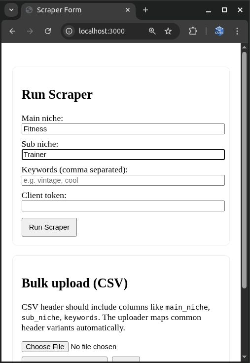
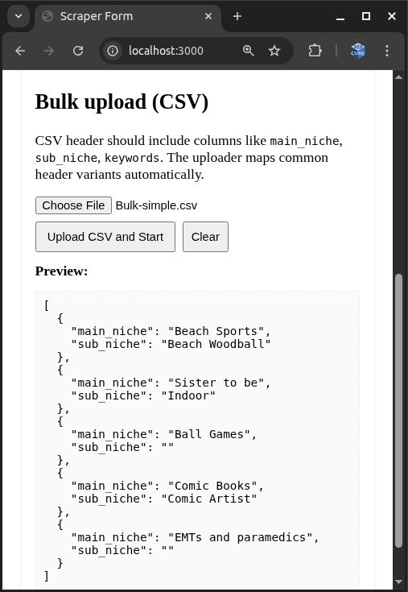
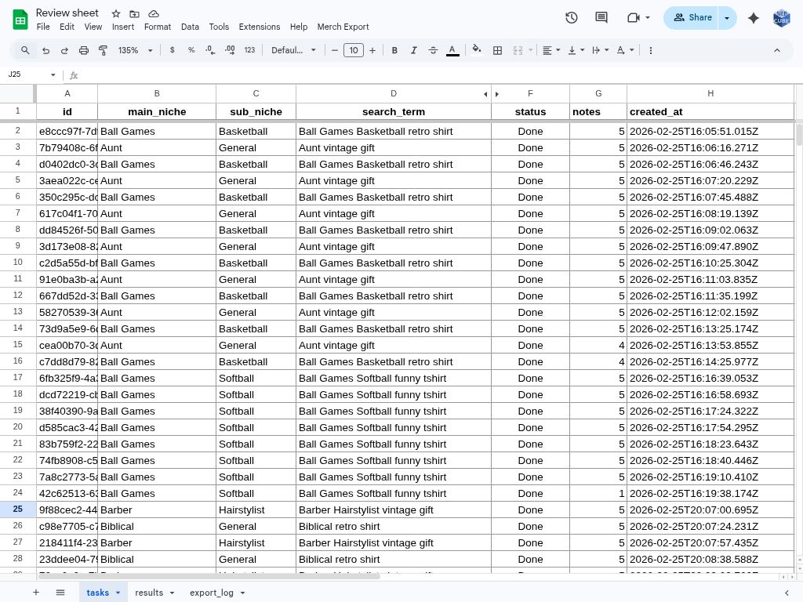
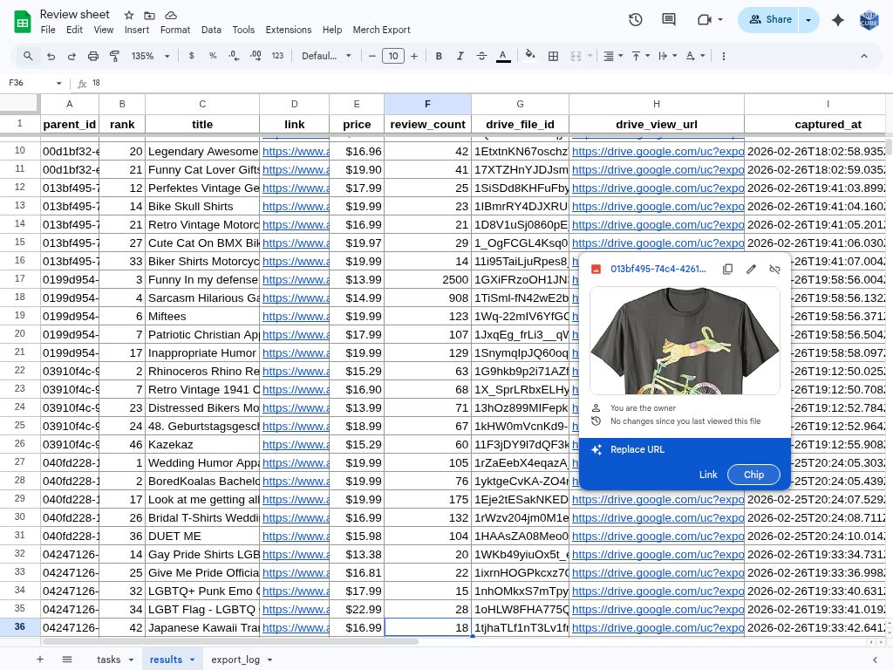
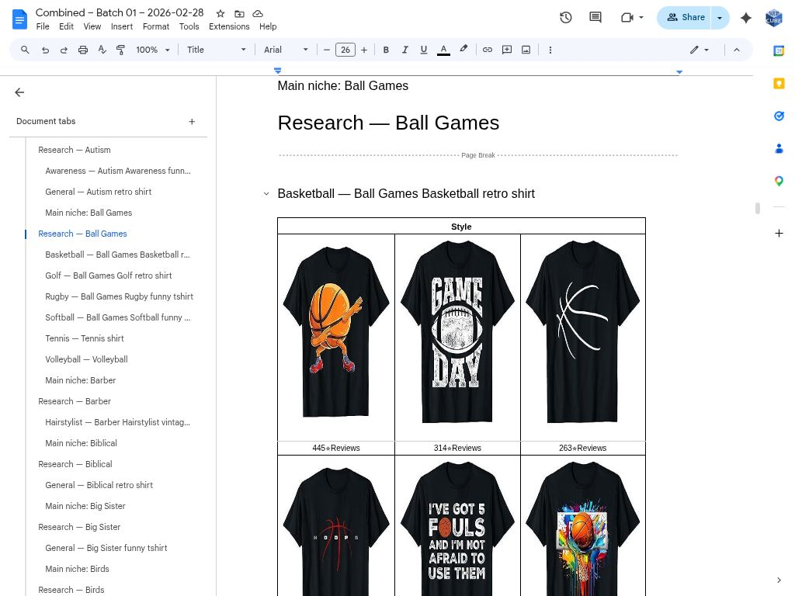
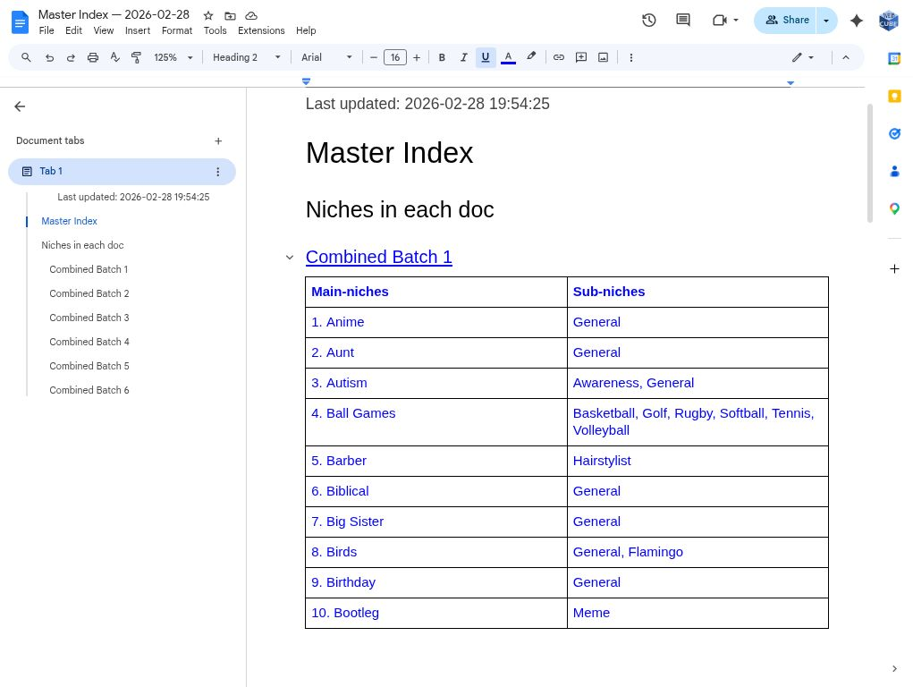
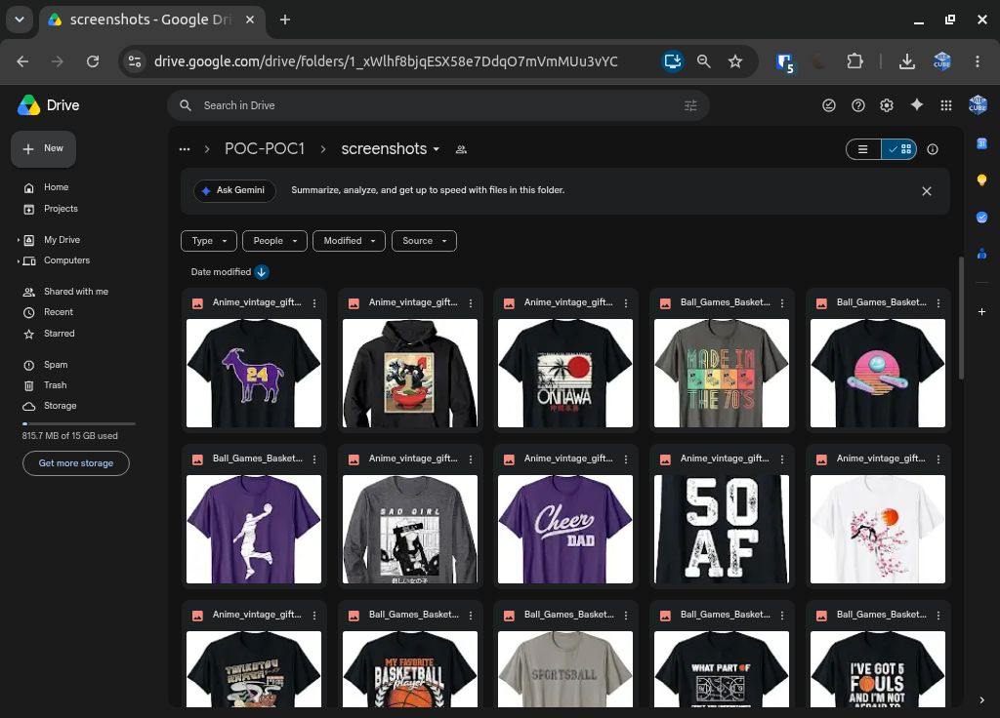
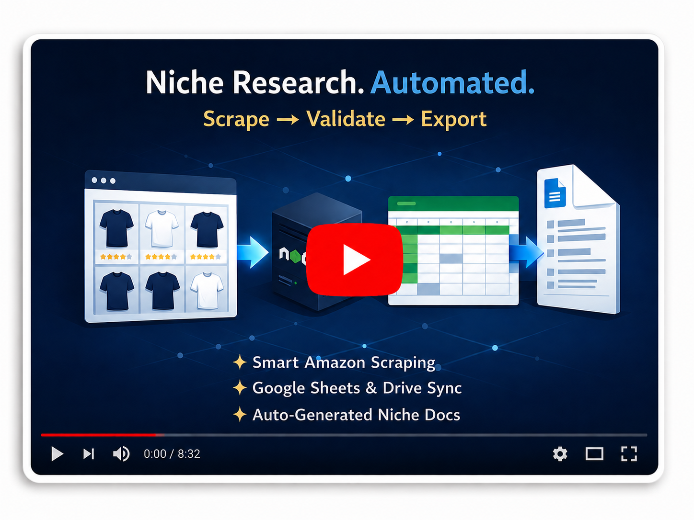

# Market Research & Export Pipeline

> Automated end-to-end pipeline that scrapes Amazon marketplace listings, deduplicates and stores results, and exports structured research documents — all without manual data wrangling.

**Generated research documentation for 55 market niches in 43 minutes (~47 seconds per niche), eliminating manual report assembly and export workflows.**

---

## What problem does it solve?

Manual product research is slow, inconsistent, and hard to scale. Analysts hunting for Amazon listings across dozens of niches spend hours copying product data, screenshotting images, deduplicating entries, and assembling research documents by hand.

This pipeline eliminates that entirely. Given a list of niches and keywords, it:

- Automatically scrapes Amazon search results (full first page per term)
- Filters out suspicious listings and deduplicates by product (ASIN + image similarity)
- Stores clean, structured results in Google Sheets with product images saved to Drive
- Exports polished, grouped research documents to Google Docs with a master index — ready to share or act on

What used to take hours of manual effort per research batch now runs as a single automated job.

---

## Technologies used

| Layer | Technology |
|---|---|
| Scraper | Node.js · Playwright (headless browser) · Jimp (image similarity) |
| Webhook & data processing | Node.js · Google Apps Script |
| Storage | Google Sheets · Google Drive |
| Document export | Google Apps Script · Google Docs API |
| Frontend (job submission) | React · Vite |
| Deployment / config | Environment variables · `.clasp.json` (Apps Script CLI) |

---

## How does it work?

The pipeline has four stages that hand off to each other automatically:

### 1. Job submission — `react-form`
A small React web app lets you submit scraping jobs without touching code. Enter your niche keywords, configure concurrency and location, or upload a CSV for bulk jobs. The form POSTs a job to the scraper server and returns a job ID.

### 2. Scraping — `poc-worker`
A Playwright-based headless browser builds search queries from your main niche and sub-niche configuration and scrapes the full first page of Amazon results. It:
- Handles location modals robustly before scraping begins
- Sorts and filters results by average rating and review count
- Deduplicates listings using image-similarity hashing (Jimp)
- Chunks large payloads and POSTs them sequentially to the webhook

Search term construction is smart: when a sub-niche already contains tokens from the main niche, the redundant main-niche tokens are dropped to avoid awkward queries.

### 3. Data ingestion — `data-receiver`
A Google Apps Script webhook receives scraped rows and:
- Filters out listings with suspicious review counts
- Writes job metadata to the **Tasks sheet** and product rows to the **Results sheet**
- Downloads product images and stores them in Google Drive, writing back the file IDs

### 4. Document export — `doc-exporter`
An Apps Script exporter reads the Results sheet and produces formatted research documents:
- Groups rows by `main_niche → sub_niche`, deduplicates by ASIN, and takes the top 9 results per search term
- Creates a temporary sub-doc per search term, then merges them into per-niche docs
- Combines up to 10 main niches into a single **Combined doc** in your output Drive folder
- Generates a **Master Index** doc linking all combined docs

The export runs in configurable batches to stay within Apps Script execution time limits, with persistent state so it can resume if interrupted.

```
React Form → poc-worker (Playwright scraper)
                 ↓
          data-receiver (Apps Script webhook)
                 ↓
     Google Sheets (Tasks + Results) + Google Drive (images)
                 ↓
          doc-exporter (Apps Script)
                 ↓
     Google Docs (Combined docs + Master Index)
```

---

## Screenshots







---

## Demo video

[](https://youtu.be/WqCKz3wZN7Y)

---

## Quick start

### Prerequisites
- Node.js 14+
- Yarn or npm
- Google Workspace account (Drive, Sheets, Docs access)
- Google Apps Script CLI (`clasp`) for deploying script files

### 1. Scraper + webhook

```bash
# Scraper
cd poc-worker
yarn install
# Configure .env (see below)
npm start

# Webhook
cd data-receiver
# Deploy via clasp to your Apps Script project
```

**`poc-worker/.env`**
```
PORT=8080
BULK_PORT=3001
WEBHOOK_URL=https://script.google.com/macros/s/<script_id>/exec
WEBHOOK_TOKEN=supersecret123
PLAYWRIGHT_CONCURRENCY=2
FORWARD_MAX_BATCH=10
```

**`data-receiver/Config.js`**
```js
const SPREADSHEET_ID = 'your_sheet_id';
const TASKS_SHEET   = 'tasks';
const RESULTS_SHEET = 'results';
const FOLDER_ID     = 'your_drive_folder_id';
const WEBHOOK_TOKEN = 'supersecret123';
```

### 2. React form

```bash
cd react-form
yarn install
# Create .env:
# VITE_SCRAPER_ENDPOINT="http://localhost:8080/api/run-scrape"
# VITE_RUN_BULK_ENDPOINT="http://localhost:3001/api/run-bulk"
npm run dev
```

### 3. Apps Script export

1. Open the `doc-exporter` Apps Script project bound to your spreadsheet.
2. Set constants in `Config.gs` (template doc ID, output folder ID, spreadsheet ID).
3. Enable the **Docs API** advanced service.
4. Run `Merch Export > Dedup by ASIN` from the sheet menu, then `Export Docs` to start.

---

## Configuration reference

| Constant | Location | Purpose |
|---|---|---|
| `DEFAULT_BATCH_SIZE` | `doc-exporter/Config.gs` | Main niches processed per Apps Script run. Start at `1`. |
| `EXPORT_STATE_PROP` | `doc-exporter/Config.gs` | Script property key for persistent export state |
| `MERGE_STATE_KEY` | `doc-exporter/Config.gs` | Script property key for merge-chunk state |
| `MAX_RESULTS_TO_WRITE` | `data-receiver/Config.js` | Max product rows written per scrape job (default: 52) |
| `PLAYWRIGHT_CONCURRENCY` | `poc-worker/.env` | Parallel browser contexts for scraping |

---

## Troubleshooting

**Apps Script execution timeout** — lower `DEFAULT_BATCH_SIZE` to `1` and increase gradually once stable.

**Images missing from Docs** — verify Drive file permissions and confirm `drive_image_file_id` was written to the Results sheet. The exporter retries blob fetches automatically; persistent failures indicate a permissions issue.

**Sheet name mismatch** — ensure `TASKS_SHEET` and `RESULTS_SHEET` constants match the actual tab names exactly.

**Duplicate products in output** — run `Merch Export > Dedup by ASIN` from the sheet menu before re-running the export.

**Stalled export** — run `stopExportAndClearState()` from the Apps Script editor to clear persisted state and restart cleanly.

---

## License

```
MIT License
Copyright (c) 2026 Webcube Automation Labs
```
